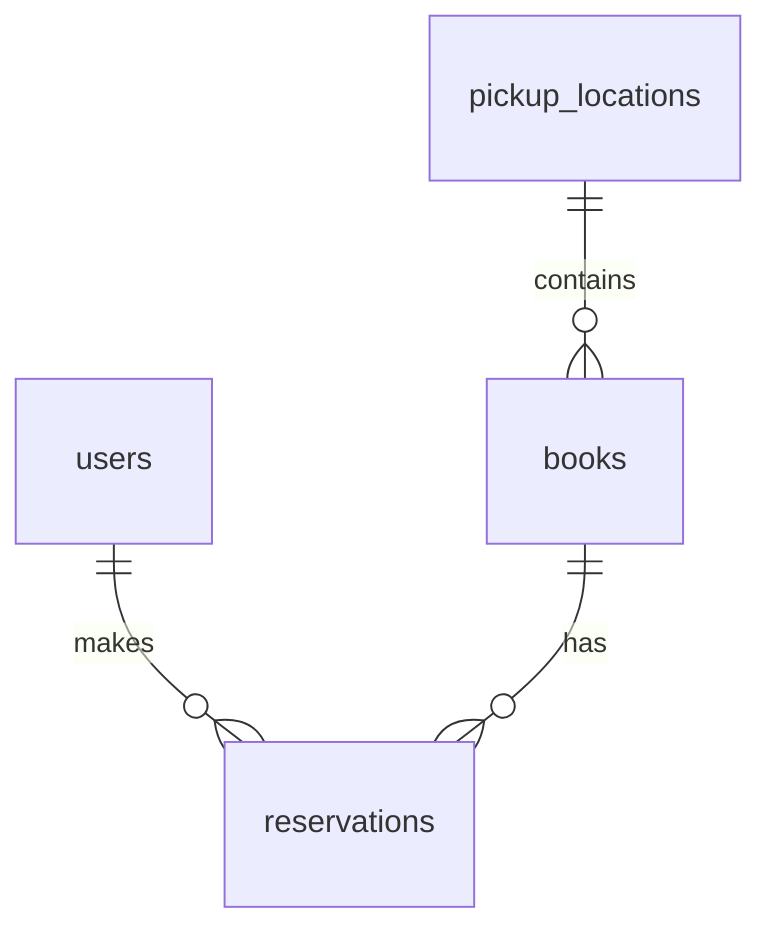

# Backend BookSwap

Лабораторная работа № 2: приложение FastAPI с разделением кода по назначению
и подключением к PostgreSQL через SQLAlchemy. Используем обычные синхронные
функции и сессии. PostgreSQL запускается в Docker, backend — на компьютере.

## Структура

```text
backend/
├── app/
│   ├── __init__.py
│   ├── main.py          # создание FastAPI и подключение маршрутов
│   ├── config.py        # настройки приложения из .env
│   ├── database.py      # движок PostgreSQL, фабрика сессий и get_db
│   ├── check_db.py      # проверка соединения запросом SELECT 1
│   ├── init_db.py       # создание таблиц в PostgreSQL
│   ├── models.py        # модели таблиц и их связи
│   ├── schemas.py       # схемы запросов и ответов Pydantic
│   ├── errors.py        # единый формат ошибок и HTTP-статусы
│   ├── crud.py          # создание и чтение записей
│   ├── services.py      # проверка существования записей и их связей
│   └── routes/
│       ├── __init__.py
│       ├── health.py    # маршрут проверки работы API
│       └── records.py   # создание и получение записей по id
├── tests/
│   └── test_api.py      # проверки запросов, ответов и ошибок
├── .env.example        # пример настроек
├── compose.yaml        # контейнер PostgreSQL и том с данными
├── .gitignore
├── requirements.txt    # зависимости Python
└── requirements-dev.txt # зависимости для тестов
```

Модели SQLAlchemy описывают таблицы БД, а схемы Pydantic — формат и проверку
данных API. Проверки связанных объектов находятся в `services.py`,
операции с БД — в `crud.py`.
`main.py` собирает приложение из этих частей.

## Запуск

Нужен Python 3.10 или новее с модулями `venv` и `pip`, а также Docker
с командой `docker compose`. Установка Docker для Ubuntu описана
в [официальной инструкции](https://docs.docker.com/engine/install/ubuntu/).
Отдельно устанавливать PostgreSQL на компьютер не нужно.

Проверить Docker:

```bash
docker --version
docker compose version
docker info
```

Подготовить окружение из корня проекта:

```bash
cd backend
python3 -m venv .venv
source .venv/bin/activate
python -m pip install -r requirements.txt
```

При первом запуске скопируйте `.env.example` в `.env`, если `.env` ещё нет:

```bash
cp .env.example .env
```

В `.env` заполните `DB_PASSWORD` своим паролем. Остальные значения подходят
для локального запуска. Пароль обязателен: с пустым значением контейнер
и backend не запустятся. Готовый `.env` повторно копировать не нужно.

Из папки `backend` запустите базу и проверьте подключение:

```bash
docker compose up -d --wait
python -m app.check_db
python -m app.init_db
python -m uvicorn app.main:app --reload
```

При первом запуске Docker скачает образ PostgreSQL 17 и создаст пользователя
и базу из `.env`. `--wait` дожидается готовности сервера.
Команда проверки должна вывести:

```text
Подключение к PostgreSQL работает: SELECT 1 = 1
```

- Проверка работы: http://127.0.0.1:8000/api/health
- Документация Swagger UI: http://127.0.0.1:8000/docs

Запрос `GET /api/health` возвращает `{"status":"ok"}`.
Этот маршрут проверяет только доступность API. Для проверки БД используется
`python -m app.check_db`. Заполненный `.env` нужен для обоих вариантов.

## Настройки и БД

| Переменная | Назначение |
| --- | --- |
| `APP_NAME` | Название API |
| `DB_HOST` | Адрес PostgreSQL для backend: `127.0.0.1` |
| `DB_PORT` | Порт БД на компьютере: `5432` |
| `DB_NAME` | Название базы: `bookswap` |
| `DB_USER` | Пользователь БД: `bookswap` |
| `DB_PASSWORD` | Пароль, задаётся только в локальном `.env` или окружении |

Docker Compose и Pydantic Settings читают один файл `backend/.env`.
Переменные окружения имеют приоритет над файлом. Настоящих паролей
в `.env.example` нет, `.env` и его локальные варианты исключены из Git.
Пароль в Python хранится как `SecretStr`, который скрывает его при выводе настроек.

В `config.py` адрес подключения собирается через `URL.create` с драйвером
`postgresql+psycopg`: специальные символы в пароле обрабатываются автоматически.
Старый параметр `DATABASE_URL` больше не используется.

Контейнер публикует порт только на `127.0.0.1`. Если порт 5432 занят,
смените `DB_PORT` в `.env`, например на `5433`. Внутри контейнера сервер
всегда слушает порт 5432.

В `database.py` настроены движок, фабрика сессий и зависимость `get_db`.
Маршруты получают сессию через `Depends(get_db)`.
Для каждого запроса создаётся отдельная сессия,
которая автоматически закрывается после обработки. Сохранение изменений
через `commit()` выполняется явно в операциях с данными.

`pool_pre_ping=True` проверяет соединение перед использованием из пула.
Время ожидания подключения ограничено пятью секундами.

## Управление PostgreSQL

Команды выполняются из папки `backend`:

```bash
docker compose ps
docker compose logs db
docker compose down
```

`down` останавливает и удаляет контейнер, но сохраняет данные в томе
`postgres_data`. Следующий `docker compose up -d --wait` использует их снова.
Параметры пользователя, пароля и названия БД применяются при первой
инициализации пустого тома. Правка `.env` сама по себе не меняет пароль
или пользователя в уже созданной базе.

## Модель данных

Одна запись в `books` — один экземпляр книги. Автор и жанр хранятся строками.
У всех таблиц первичный ключ `id` — целое число, которое генерирует PostgreSQL.
Все поля обязательны (`NOT NULL`); описание по умолчанию — пустая строка.

| Таблица | Поля, кроме `id` |
| --- | --- |
| `users` — пользователи | `name` — имя (100 символов), `email` — уникальная почта (255) |
| `pickup_locations` — пункты выдачи | `name` — название (200), `address` — адрес (300), `hours` — часы работы (200), `description` — текст |
| `books` — книги | `title` — название (255), `author` — автор (255), `genre` — жанр (100), `year` — год (целое), `pages` — страницы (целое), `description` — текст, `location_id` — внешний ключ |
| `reservations` — бронирования | `book_id`, `user_id` — внешние ключи, `status` — статус (20), `reserved_at` — дата бронирования, `due_at` — срок возврата |

Связи «один ко многим»:



- `books.location_id` ссылается на `pickup_locations.id`.
- `reservations.user_id` ссылается на `users.id`.
- `reservations.book_id` ссылается на `books.id`.

Связи описаны внешними ключами в БД и `relationship` в Python.
Нельзя удалить пункт с книгами, а также книгу или пользователя с бронированиями:
внешние ключи используют `ON DELETE RESTRICT`.

Статусы бронирования: `reserved` (забронирована), `borrowed` (выдана),
`returned` (возвращена), `cancelled` (бронь отменена). По умолчанию статус —
`reserved`, дата бронирования — текущая дата БД. Срок возврата задаётся явно.
Частичный уникальный индекс разрешает только одно активное бронирование
(`reserved` или `borrowed`) на экземпляр книги, сохраняя историю остальных.
Отдельного статуса у книги нет: доступность определяется активным бронированием.
Проверки `CHECK` запрещают неизвестные статусы, неположительные год и число
страниц, срок возврата раньше даты бронирования.

Создание таблиц из папки `backend`:

```bash
python -m app.init_db
```

Команда создаёт отсутствующие таблицы. Повторный запуск не удаляет данные.
`create_all` не обновляет структуру уже существующих таблиц; для дальнейших
изменений схемы понадобятся миграции.

Изменение, удаление, списки записей и правила перехода между статусами
добавим в следующих заданиях.
Поля для авторизации пока не добавлены. Имена полей БД используют `snake_case`,
идентификаторы бронирований в БД — целые числа; преобразование формата для
frontend будет выполнено при подключении API.
Frontend пока использует демонстрационные данные.

## Валидация запросов и ответов

В `schemas.py` для пользователя, пункта выдачи, книги и бронирования есть
схемы `Create`, `Update` и `Read`. `Update` описывает полную замену данных
для будущего `PUT`, а не частичный `PATCH`. Маршруты изменения пока не добавлены.
Схемы `Read` используют `from_attributes=True` и принимают объекты SQLAlchemy.
Ответы маршрутов проверяются через `response_model`.

Проверяются обязательные поля, длины строк по модели БД, формат почты,
положительные целые числа в пределах PostgreSQL INTEGER, допустимые статусы
и срок возврата не раньше даты бронирования. Строки очищаются от пробелов
по краям, пустые названия и неизвестные поля запрещены. Числа в JSON нужно
передавать числами: строки `"100"` и логические значения вместо числа не принимаются.
Даты передавайте как `"2026-09-28"`.

Для проверки схем через API добавлены минимальные операции:

| Ресурс | Создание | Получение по идентификатору |
| --- | --- | --- |
| Пользователи | `POST /api/users` | `GET /api/users/{record_id}` |
| Пункты выдачи | `POST /api/locations` | `GET /api/locations/{record_id}` |
| Книги | `POST /api/books` | `GET /api/books/{record_id}` |
| Бронирования | `POST /api/reservations` | `GET /api/reservations/{record_id}` |

При создании книги проверяется существование пункта выдачи, при создании
бронирования — пользователя и книги. Поле `id` назначает БД; в запросе
создания его передавать не нужно. Проверять запросы удобно в `/docs`.

| HTTP-статус | Когда возвращается |
| --- | --- |
| `200 OK` | Запись получена |
| `201 Created` | Запись создана |
| `404 Not Found` | Запись, связанный объект или маршрут не найдены |
| `405 Method Not Allowed` | Метод не поддерживается маршрутом |
| `409 Conflict` | Почта уже занята, книга уже забронирована или нарушены связи БД |
| `422 Unprocessable Entity` | Некорректные поля, идентификатор или JSON |
| `500 Internal Server Error` | Внутренняя ошибка работы с БД или формирования ответа |
| `503 Service Unavailable` | Соединение с БД недоступно |

Ошибки имеют единый формат: `detail` — сообщение, `errors` — список ошибок
полей (для ошибок вне валидации он пустой). Например, запрос:

```http
POST /api/users
Content-Type: application/json

{"name": "Анна", "email": "wrong"}
```

вернёт `422`:

```json
{
  "detail": "Некорректные данные запроса.",
  "errors": [
    {"field": "body.email", "message": "Укажите корректный адрес электронной почты."}
  ]
}
```

Запрос отсутствующей книги вернёт `404`:

```json
{"detail": "Книга не найдена.", "errors": []}
```

Сообщения об ошибках БД не содержат SQL-запросы и параметры подключения.
После неудачного сохранения сессия откатывается через `rollback()`.
Схема ошибок также описана в Swagger.

## Проверка API

Нужны запущенная PostgreSQL и созданные таблицы. Из папки `backend`:

```bash
source .venv/bin/activate
python -m pip install -r requirements-dev.txt
python -m unittest discover -s tests -v
```

Тесты проверяют создание и чтение всех сущностей, валидацию, отсутствие записей,
конфликты, статусы HTTP и скрытие внутренних ошибок. Изменения выполняются
в тестовых транзакциях и откатываются, даже когда код приложения вызывает `commit()`.

Разделение маршрутов основано на [документации FastAPI](https://fastapi.tiangolo.com/tutorial/bigger-applications/).
Настройки контейнера описаны в [документации образа PostgreSQL](https://hub.docker.com/_/postgres).
